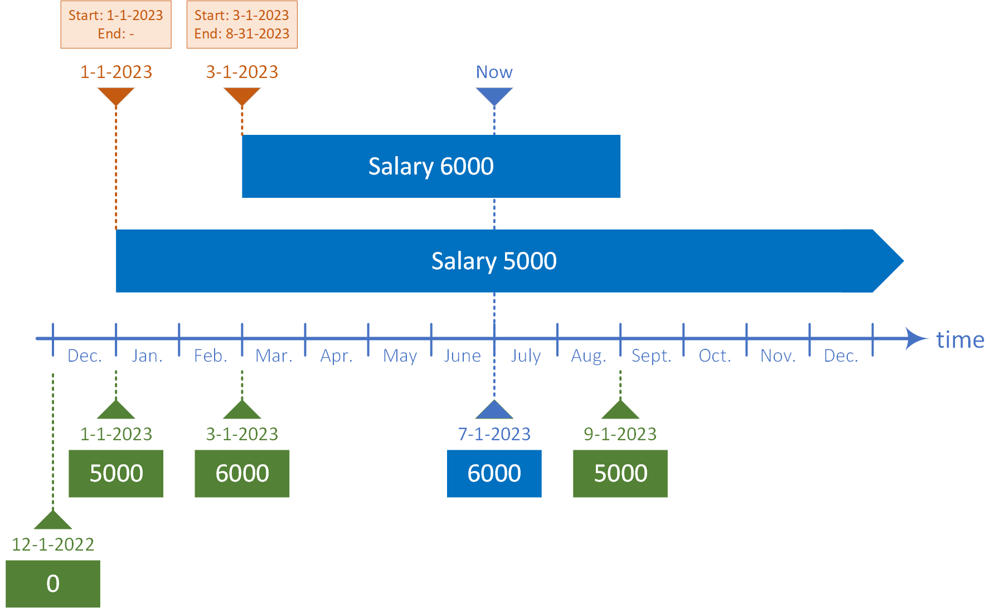
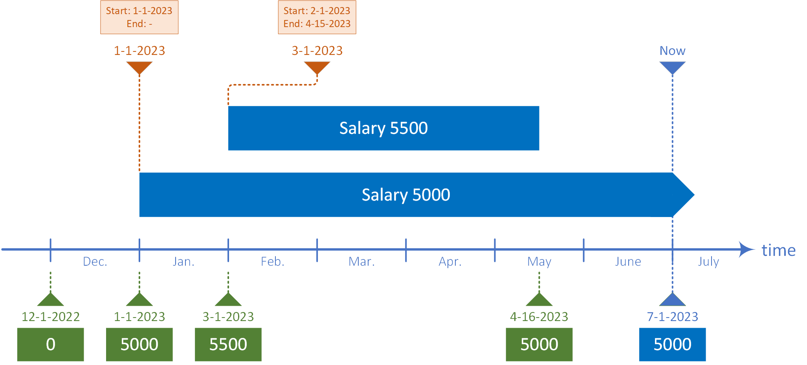
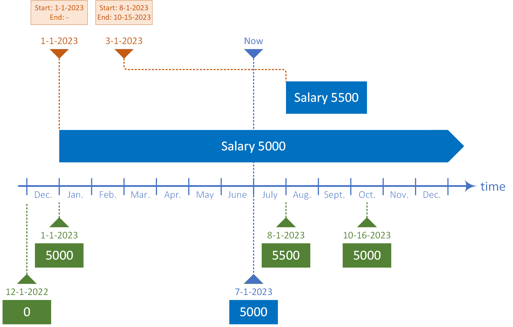

# Travel through Time Data

I love time travel movies because I am fascinated by mind games with time. The topic of time has also accompanied me for a long time in my profession, where I have dealt with complex [time calculations](https://www.codeproject.com/Articles/168662/Time-Period-Library-for-NET). My last open source [project](https://github.com/Payroll-Engine/PayrollEngine) was about being able to control the lifecycle of business data at the field level.

Established historization and audit trail approaches are not suitable due to additional business requirements:
- Data is controlled at the field level, not the object level
- Data can be changed multiple times
- Data can be changed and undone retroactively
- Data changes can be scheduled
- Data analysis with data from the past and (back to) the future

Using an employee's salary, I would like to show how I solved the problem with **time data**. In the initial situation we have the employee `name@domain.com` with a monthly salary of `5000`.
```json
{
  "id": "name@domain.com",
  "salary": 5000
}
```

### Time Data
In addition to the actual value, time data also contains time information with the creation date and a time period in which the value is to apply.
The illustration of the above example with time data and an additional time limit until the end of `2023`:
```json
{
  "id": "name@domain.com",
  "salary": [
    {
      "value": 5000,
      "created": "2023-01-01T00:00:00.0Z",
      "period": {
        "start": "2023-01-01T00:00:00.0Z",
        "end": "2023-12-31T23:59:59.9Z"
      }
    }
  ]
}
```

The time data is immutable, so a new time value is created the next time the salary is adjusted. In the following example, the salary is increased to `6000` from March to the end of August.
```json
{
  "id": "name@domain.com",
  "salary": [
    {
      "value": 5000,
      "created": "2023-01-01T00:00:00.0Z",
      "period": {
        "start": "2023-01-01T00:00:00.0Z"
      }
    },
    {
      "value": 6000,
      "created": "2023-03-01T00:00:00.0Z",
      "period": {
        "start": "2023-03-01T00:00:00.0Z",
        "end": "2023-08-31T23:59:59.9Z"
      }
    }
  ]
}
```

Based on this information, the value can be determined at any point in time. Time data literally opens up new perspectives: I can freely choose a point in time and look at the data from that point on. I have named the observation date of the time values **evaluation date**.

With the variable evaluation date, interesting evaluations are possible:
- Past view - analysis of the data as it was at an earlier point in time.
- Future view - analysis of the data as it will be at a future point in time.

The following figure shows different evaluation dates for the above example:
<p align="center">
    
</p>

### Example for past Time Data
In this example the salary was changed on March 1, 2023, retroactive to February. The new salary of `5500` is to be valid until mid-April 2023.
```json
{
  "id": "name@domain.com",
  "salary": [
    {
      "value": 5000,
      "created": "2023-01-01T00:00:00.0Z",
      "period": {
        "start": "2023-01-01T00:00:00.0Z"
      }
    },
    {
      "value": 5500,
      "created": "2023-03-01T00:00:00.0Z",
      "period": {
        "start": "2023-02-01T00:00:00.0Z",
        "end": "2023-04-15T23:59:59.9Z"
      }
    }
  ]
}
```

The query of the evaluation time data values gives the following picture:
<p align="center">
    
</p>

### Example for future Time Data
In this scenario, the salary has been increased to `4500` on March 1, 2023. The adjustment is effective from September through mid-October.

```json
{
  "id": "name@domain.com",
  "salary": [
    {
      "value": 5000,
      "created": "2023-01-01T00:00:00.0Z",
      "period": {
        "start": "2023-01-01T00:00:00.0Z"
      }
    },
    {
      "value": 5500,
      "created": "2023-03-01T00:00:00.0Z",
      "period": {
        "start": "2023-08-01T00:00:00.0Z",
        "end": "2023-10-15T23:59:59.9Z"
      }
    }
  ]
}
```

This results in the following time data values:
<p align="center">
    
</p>

### Time Data with C-Sharp
The example contains the following types
- `TimeValue` - contains the time data
- `TimeField` - time field with multiple time data
- `Employee` - employee with salary as time data
- `Extensions` - time data  calculations

```csharp
public class TimeValue<T>
{
    public DateTime Created { get; set; }
    public ValuePeriod Period { get; set; }
    public T Value { get; set; }
}

public class TimeField<T> : Collection<TimeValue<T>>
{
}

public class Employee
{
    public string? Id { get; set; }
    public TimeField<decimal>? Salary { get; set; }
}

public static class Extensions
{
    public static bool IsInside<T>(this TimeValue<T> value,
                                   DateTime evaluationDate) =>
        evaluationDate >= value.Period.Start && 
        evaluationDate <= value.Period.End;

    public static TimeValue<T>? GetTimeValue<T>(
                this TimeField<T> values, DateTime evaluationDate)
    {
        if (!values.Any())
        {
            return default;
        }

        var timeValues = values.
            // remove values created after the evaluation date
            Where(x => x.Created <= evaluationDate &&
                       // remove outside periods
                       x.IsInside(evaluationDate)).ToList();
        if (!timeValues.Any())
        {
            return default;
        }

        // select the evaluated value (last created)
        var timeValue = timeValues.OrderByDescending(x => 
                                            x.Created).First();
        return timeValue;
    }
}
```

The algorithm for calculating the current time value `GetTimeValue` first excludes the time values that were created after the evaluation time or are irrelevant (`IsInside`). From the remaining time values, the most recent one is selected.

### Time Data Mapping
In relational models, time data can be kept in separate entities/tables. If the amount of time data is small, the simplest scenario is to have a separate table containing the time data, for example, `EmployeeSalary`. For larger amounts of time data, it is recommended to group them into tables:
- By data type e.g. `TimeDataDecimal`, `TimeDataInteger`...
- By object e.g. `EmployeeTimeData`.
    - One column per data type
    - One text column with JSON representation

To convert time data to traditional data, the time data value is determined from the current time. The conversion of traditional values to time data is represented by a period that starts immediately and is unbounded.

<br />
*Have a good time*.


